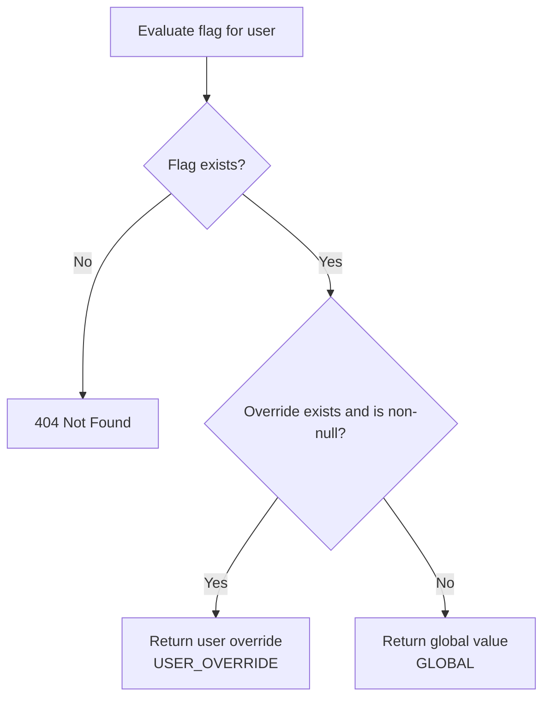
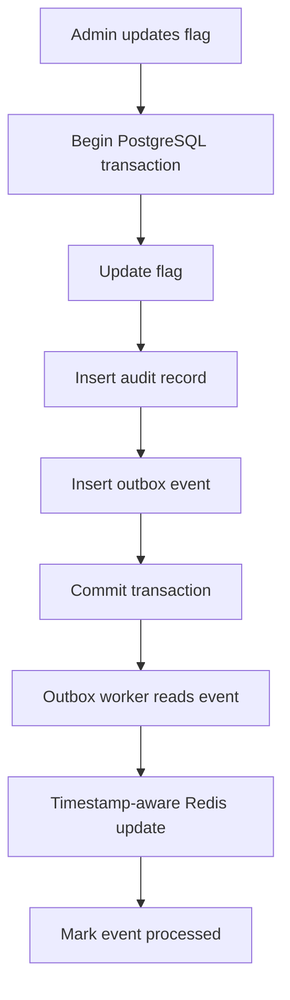

# Feature Management Service — Phased Development Plan

This document defines an incremental delivery plan from a runnable Spring Boot foundation through a production-grade, cache-backed feature flag platform.


|                    |                                                                                              |
| ------------------ | -------------------------------------------------------------------------------------------- |
| **Related design** | [High-Level Design](./high-level-design.md)                                                  |
| **Stack**          | Java 21 • Spring Boot • PostgreSQL • Liquibase • Redis                                       |
| **Build**          | Gradle (Kotlin DSL)                                                                          |
| **Process**        | Each phase is a separate, reviewable pull request with its own tests and acceptance criteria |


> **Where to start:** Phase 1 — Spring Boot + PostgreSQL + Liquibase. Get the application running, establish the schema, and verify migrations before building APIs.

---

## Recommended milestones


| Milestone                     | Phases | Outcome                                               |
| ----------------------------- | ------ | ----------------------------------------------------- |
| **M1 — Functional MVP**       | 1–5    | CRUD, overrides, evaluation using PostgreSQL          |
| **M2 — Data integrity**       | 6      | Audit trail and atomic writes                         |
| **M3 — Scalable evaluation**  | 7–8    | Redis caching and reliable cache synchronization      |
| **M4 — Production hardening** | 9–11   | Security, error handling, automated tests, monitoring |
| **M5 — Deployment**           | 12     | Running on DigitalOcean infrastructure                |


---

## Phase 1 — Spring Boot, PostgreSQL, and Liquibase

**Goal:** A running Spring Boot application connected to PostgreSQL, with database schema managed entirely by Liquibase.

### Implementation tasks

1. Generate a Spring Boot project using Java 21.
2. Add Spring Web, Spring Data JPA, PostgreSQL Driver, Liquibase, Spring Validation, Actuator, and Spring Boot Test.
3. Configure PostgreSQL using Docker Compose.
4. Configure database connection properties and environment variables.
5. Create Liquibase master changelog.
6. Create the initial `feature_flags` database table.
7. Configure Hibernate with `ddl-auto=validate`, not `update`.
8. Start the application and verify Liquibase migrations run successfully.

### Liquibase file structure

```text
src/main/resources/
└── db/changelog/
    ├── db.changelog-master.yaml
    └── changes/
        └── 001-create-feature-flags.yaml
```

### Initial feature flag schema


| Column           | Type              |
| ---------------- | ----------------- |
| `id`             | UUID, primary key |
| `name`           | VARCHAR(150)      |
| `description`    | TEXT              |
| `global_enabled` | BOOLEAN           |
| `created_by`     | VARCHAR(100)      |
| `created_at`     | TIMESTAMPTZ       |
| `updated_by`     | VARCHAR(100)      |
| `updated_at`     | TIMESTAMPTZ       |


Add a unique constraint on `name`.

> V1 deliberately omits `project_id`, `environment`, lifecycle `state`, and optimistic-lock `version`. Flags are globally unique by name; enablement is controlled only by `global_enabled` and per-user overrides.

### Completion criteria

Spring Boot starts, PostgreSQL is reachable, Liquibase creates the table automatically, and the application health endpoint responds.

---

## Phase 2 — JPA Entities and Repository Layer

**Goal:** Implement the persistence layer before exposing APIs.

### Implementation tasks

1. Create the `FeatureFlag` JPA entity.
2. Create `FeatureFlagRepository` extending `JpaRepository`.
3. Implement lookup and existence checks by unique flag `name`.
4. Add integration tests using PostgreSQL Testcontainers.

### Main classes

```text
entity/FeatureFlag.java
repository/FeatureFlagRepository.java
```

### Completion criteria

Repository tests confirm insert, lookup, update, and uniqueness on `name`.

---

## Phase 3 — Feature Flag CRUD APIs

**Goal:** Administrators can manage global feature flags.

### APIs


| Method   | Endpoint               | Description                        |
| -------- | ---------------------- | ---------------------------------- |
| `POST`   | `/api/v1/flags`        | Create a flag                      |
| `GET`    | `/api/v1/flags`        | List flags with pagination         |
| `GET`    | `/api/v1/flags/{name}` | Get a flag                         |
| `PATCH`  | `/api/v1/flags/{name}` | Update description or global value |
| `DELETE` | `/api/v1/flags/{name}` | Delete a flag                      |


### Implementation tasks

1. Create `FeatureFlagController`.
2. Create `FeatureFlagService`.
3. Add request and response DTOs.
4. Implement input validation and duplicate-name checks (flag names: no spaces, reasonable length limits, conservative character set).
5. Add pagination and sorting.
6. Implement delete (remove the flag record; audit history remains for later phases).
7. Return appropriate HTTP response codes (`400`, `404`, `409`, etc.).

### Example

```http
PATCH /api/v1/flags/new-checkout
```

```json
{
  "description": "Redesigned checkout flow",
  "globalEnabled": true
}
```

### Completion criteria

All five APIs work against PostgreSQL and have service-level tests.

> During this local development phase, mutation history is not yet complete. These endpoints should not be exposed to production users until the audit and security phases are finished.

---

## Phase 4 — Per-User Override Management

**Goal:** Support explicit feature enablement or disablement for individual users.

### Database migration

`002-create-feature-overrides.yaml`


| Column       | Type              |
| ------------ | ----------------- |
| `flag_id`    | UUID, foreign key |
| `user_id`    | VARCHAR(150)      |
| `enabled`    | BOOLEAN, nullable |
| `updated_by` | VARCHAR(100)      |
| `updated_at` | TIMESTAMPTZ       |


Primary key: `(flag_id, user_id)`.

Use `NULL` as an optional tombstone meaning the override was removed (inherit global). `updated_at` is used for cache freshness when Redis is introduced.

### APIs


| Method   | Endpoint                                  |
| -------- | ----------------------------------------- |
| `PUT`    | `/api/v1/flags/{name}/overrides/{userId}` |
| `GET`    | `/api/v1/flags/{name}/overrides`          |
| `DELETE` | `/api/v1/flags/{name}/overrides/{userId}` |


### Example body

```json
{
  "enabled": false
}
```

### Completion criteria

Overrides can be created, changed, removed, and retrieved independently of global values. Removing an override restores inheritance from the global value.

---

## Phase 5 — Feature Evaluation API

**Goal:** Build the complete evaluation logic using PostgreSQL only.

Do **not** introduce Redis yet. First gain confidence that the evaluation logic itself is correct.

### Endpoint

```http
GET /api/v1/evaluations/{flagName}?userId={userId}
```

### Example response

```json
{
  "flag": "new-checkout",
  "userId": "user123",
  "enabled": true,
  "reason": "USER_OVERRIDE"
}
```

### Evaluation algorithm




### Essential unit tests


| Global  | Override           | Expected             | Reason          |
| ------- | ------------------ | -------------------- | --------------- |
| `true`  | Missing            | `true`               | `GLOBAL`        |
| `false` | Missing            | `false`              | `GLOBAL`        |
| `true`  | `false`            | `false`              | `USER_OVERRIDE` |
| `false` | `true`             | `true`               | `USER_OVERRIDE` |
| `true`  | `null` / inherited | `true`               | `GLOBAL`        |
| —       | —                  | flag missing → `404` | —               |


### Completion criteria

All precedence tests pass, and the evaluation endpoint works without caching. Non-existent flags return `404`; invalid flag names return `400`.

### Milestone 1 — Functional MVP

At the end of Phase 5, the core feature flag system is functional. You can demonstrate CRUD, user overrides, and evaluation.

---

## Phase 6 — Audit Trail

**Goal:** Make database mutations atomic and traceable.

### Database migration

`003-create-feature-audit.yaml`

Columns: `id`, `flag_id`, `action`, `actor_id`, `change_map`, `request_id`, `created_at`.

Use PostgreSQL `JSONB` for `change_map`.

### Example audit event

```json
{
  "action": "FLAG_UPDATED",
  "actorId": "admin-101",
  "changeMap": {
    "globalEnabled": {
      "previous": false,
      "new": true
    }
  }
}
```

### Implementation tasks

1. Create the `FeatureAudit` entity and repository.
2. Create `AuditService`.
3. Modify flag and override mutation services to generate `changeMap`.
4. Use `@Transactional` so updates and audit inserts commit together.
5. Add an audit history API with pagination.
6. Add rollback tests: if audit persistence fails, the update must roll back.

### Completion criteria

Every committed mutation has an audit record. There is no optimistic-lock `version` field in V1; last successful commit wins for concurrent admin edits.

---

## Phase 7 — Redis Caching

**Goal:** Speed up evaluations and reduce PostgreSQL traffic.

### Implementation tasks

1. Add Spring Data Redis.
2. Run Redis locally using Docker Compose.
3. Create `FeatureCacheService` using `StringRedisTemplate` or Redis hash operations.
4. Cache global flag metadata.
5. Cache explicit user overrides.
6. Cache `INHERIT` when no override exists (negative caching).
7. Add TTLs and bounded database fallback.
8. Test behavior when Redis becomes unavailable.

### Example cache keys

```text
ff:flag:{name}
ff:override:{flagId}:{userId}
```

Store `updatedAt` (or equivalent) with cache entries so later synchronization can reject outdated updates.

### Completion criteria

Warm evaluations use Redis, cold evaluations fall back to PostgreSQL, and all evaluation results remain logically correct.

---

## Phase 8 — Transactional Outbox and Reliable Cache Synchronization

**Goal:** Make Redis cache synchronization reliable after database mutations.

### Database migration

`004-create-outbox-events.yaml`

### Implementation tasks

1. Create `OutboxEvent` entity and repository.
2. Insert outbox events in the same transaction as flag updates and audit events.
3. Build `CacheSyncWorker` to process pending events.
4. Implement retry handling and worker-safe event claiming.
5. Apply timestamp-aware cache updates using atomic Redis operations (`updatedAt` wins).
6. Handle override removal using `INHERIT` tombstones.
7. Add tests for delayed events, duplicate processing, and out-of-order updates.

### Update flow




### Completion criteria

An unavailable Redis instance cannot cause the database update to lose its audit record or synchronization event. Replayed outbox events are safe.

> The evaluation path is eventually consistent; stronger guarantees require an additional consistency protocol.

---

## Phase 9 — Spring Security

**Goal:** Restrict management operations; allow trusted callers for evaluation.

### Implementation tasks

1. Integrate Spring Security.
2. Configure OAuth2 Resource Server / JWT validation or an equivalent trusted authentication mechanism.
3. Define admin and read-only roles.
4. Protect flag mutation and audit APIs.
5. Obtain `actorId` from the authenticated principal.
6. Authenticate application-to-application evaluation requests.
7. Test unauthorized access.

### Completion criteria

No administrative endpoint is publicly writable. Evaluation requires a trusted service credential.

---

## Phase 10 — Global Error Handling and Resilience

**Goal:** Handle application and infrastructure failures predictably; satisfy final readiness for validation and HTTP status codes.

### Implementation tasks

1. Create a global `@RestControllerAdvice`.
2. Define consistent HTTP error responses.
3. Return `404` for unknown / non-existent flags.
4. Return `409` for duplicate flag names.
5. Return `400` for invalid input (including flag names with spaces or invalid length).
6. Return `503` when evaluation cannot safely continue.
7. Add request timeouts and circuit breakers where necessary.
8. Protect PostgreSQL from excessive fallback traffic during Redis outages.
9. Add idempotency handling for retry-sensitive mutations.

### Completion criteria

Failure scenarios produce predictable results and do not corrupt flag or audit data. Invalid flag names and missing flags return the correct status codes.

---

## Phase 11 — Tests, Metrics, Logging, CI, and README

**Goal:** Demonstrate that the service is suitable for production traffic and meet final readiness for tests, CI/CD, and documentation.

### Test coverage


| Test type                     | What to verify                                |
| ----------------------------- | --------------------------------------------- |
| JUnit 5                       | Business logic and override precedence        |
| Mockito                       | Service behavior and failure branches         |
| Testcontainers                | Real PostgreSQL and Redis integration         |
| Spring Boot integration tests | **At least one HTTP end-to-end** request flow |
| Concurrency tests             | Simultaneous updates (last-commit-wins in V1) |
| Cache consistency tests       | Stale reads and out-of-order updates          |
| Load tests                    | Throughput and p95/p99 evaluation latency     |
| Failure tests                 | Redis outage, database outage, worker restart |


### CI/CD (GitHub Actions)

1. Add `.github/workflows/ci.yml` (or equivalent).
2. On pull request and `main`: set up Java 21, run `./gradlew test`, fail on errors.
3. Optionally build/publish the container image in later hardening.

### README (required)

`README.md` must cover:

1. **Setup** — Java 21, Docker Compose for PostgreSQL/Redis, how to run the app, health endpoint.
2. **Flag evaluation rules** — override precedence (`USER_OVERRIDE` > `GLOBAL`), example `reason` codes.
3. **How caching is implemented** — key layout, TTLs, read-through, outbox invalidation/update, Redis-down fallback.
4. Link to the HLD evaluation-path architecture diagram (cache consult / bypass / invalidate).

Add Spring Boot Actuator and Micrometer metrics for cache hit rate, evaluation latency, database fallback rate, error rate, and outbox lag.

### Completion criteria

Unit tests and at least one HTTP e2e integration test pass; GitHub Actions runs them on every PR; metrics are available; README documents setup, evaluation rules, and caching.

---

## Phase 12 — Docker and DigitalOcean Deployment

**Goal:** Run and operate the complete system in a production-like environment.

### Implementation tasks

1. Build a production Spring Boot Docker image.
2. Create a local Docker Compose stack for application, PostgreSQL, and Redis.
3. Ensure the GitHub Actions CI workflow runs tests and can package the image.
4. Push the image to a container registry.
5. Provision DigitalOcean Managed PostgreSQL and Managed Redis.
6. Deploy the Spring Boot application to DOKS (Kubernetes).
7. Run Liquibase migrations in a controlled deployment step.
8. Configure Helm values (`orchestration/helm/.../values-<env>.yaml`), secrets, readiness probes, and resource limits.
9. Deploy multiple application replicas.
10. Validate end-to-end behavior and failure recovery.

### Completion criteria

The system is deployed, secured, observable, and passes smoke tests against its production-like infrastructure.

---

## Final project structure

By the end of all phases, the project should look approximately like this:

```text
feature-management-service/
├── src/
│   ├── main/
│   │   ├── java/com/example/featuremanagement/
│   │   │   ├── controller/
│   │   │   ├── service/
│   │   │   │   ├── FeatureFlagService.java
│   │   │   │   ├── FeatureOverrideService.java
│   │   │   │   ├── FeatureEvaluationService.java
│   │   │   │   └── AuditService.java
│   │   │   ├── entity/
│   │   │   ├── repository/
│   │   │   ├── cache/
│   │   │   ├── worker/
│   │   │   ├── dto/
│   │   │   ├── exception/
│   │   │   └── config/
│   │   └── resources/
│   │       ├── application.yml
│   │       └── db/changelog/
│   │           ├── db.changelog-master.yaml
│   │           └── changes/
│   │               ├── 001-create-feature-flags.yaml
│   │               ├── 002-create-feature-overrides.yaml
│   │               ├── 003-create-feature-audit.yaml
│   │               └── 004-create-outbox-events.yaml
│   └── test/
├── orchestration/
│   └── helm/
│       └── feature-management-service/
│           ├── Chart.yaml
│           ├── values.yaml
│           ├── values-dev.yaml
│           └── templates/
├── Dockerfile
├── compose.yaml
├── build.gradle.kts
├── settings.gradle.kts
└── README.md
```


---

## Final readiness expectations (required of this service)

The service is not complete until all of the following are implemented and demonstrated:


| #   | Expectation                                                                                                                        | Where it lands in the plan  |
| --- | ---------------------------------------------------------------------------------------------------------------------------------- | --------------------------- |
| 1   | **Architecture diagram** — evaluation request path; where Redis sits; when consulted, bypassed, or invalidated/updated             | HLD §06; README; Phases 7–8 |
| 2   | **Validation & error handling** — flag names (no spaces, length limits); correct status codes (`404` for non-existent flags, etc.) | Phases 3, 5, 10             |
| 3   | **Unit tests + one HTTP e2e integration test**                                                                                     | Phases 2–5, 11              |
| 4   | **CI/CD via GitHub Actions**                                                                                                       | Phases 11–12                |
| 5   | **README** — setup, flag evaluation rules, how caching works                                                                       | Phase 11                    |


### Checklist

- [ ] Evaluation-path architecture diagram (cache consult / bypass / invalidate)
- [ ] Flag name validation and consistent HTTP errors including `404`
- [ ] Unit tests for core rules + at least one HTTP end-to-end integration test
- [ ] GitHub Actions CI running `./gradlew test`
- [ ] README covers setup, evaluation rules, and caching behavior

---

## Interview narrative

This plan gives both a working service and a clear progression you can explain in a DigitalOcean interview — from basic persistence to scalable, auditable, production-grade feature management:

1. **Phases 1–5:** Correct domain behavior on PostgreSQL alone (unique flag names, overrides, evaluation).
2. **Phase 6:** Write-time correctness with an immutable audit trail.
3. **Phases 7–8:** Low-latency reads with explicit eventual consistency via outbox sync.
4. **Phases 9–11:** Security, resilience, tests/CI, README, and evidence of operability.
5. **Phase 12:** Deploy and operate on DigitalOcean infrastructure.

